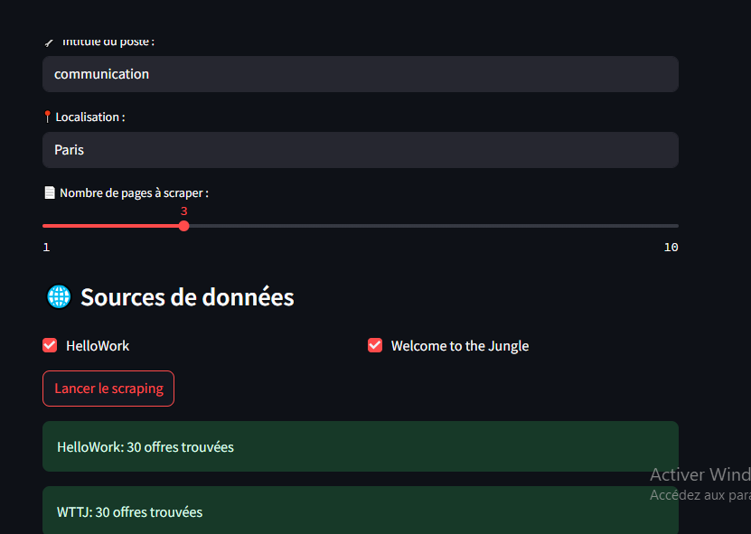
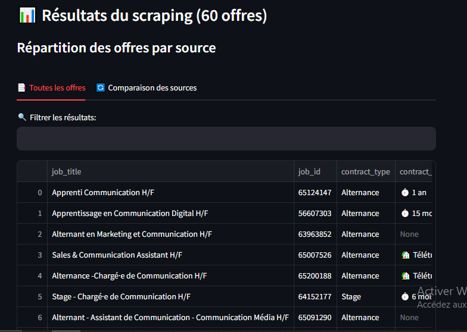
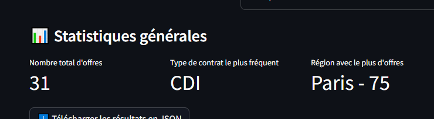
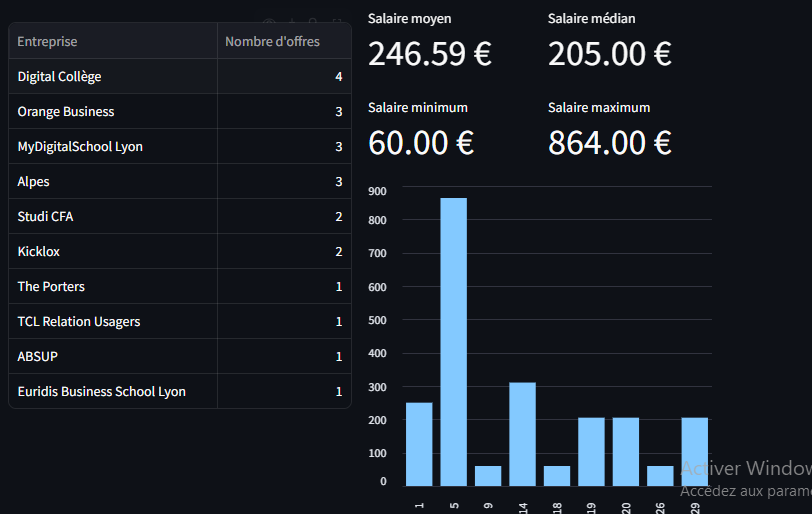
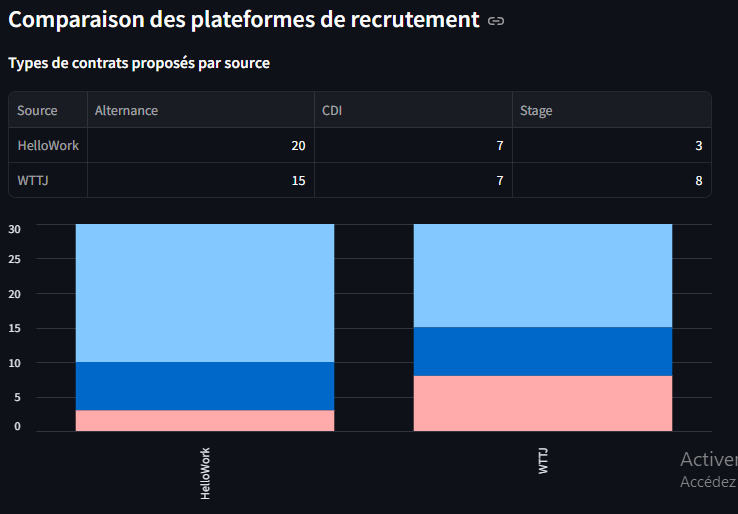
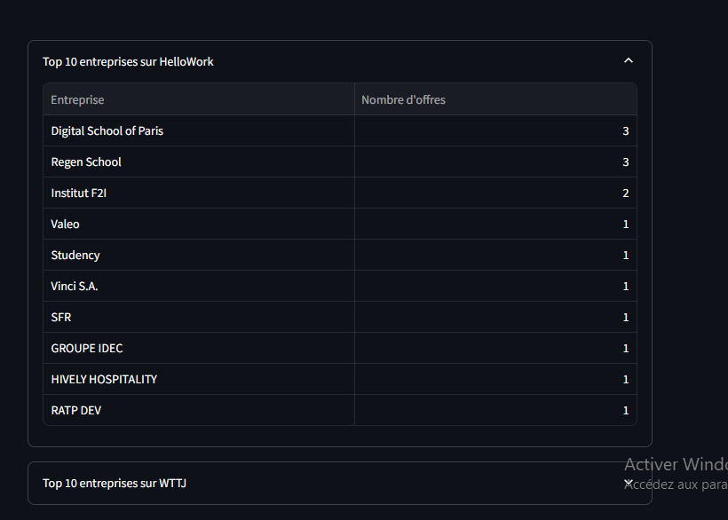
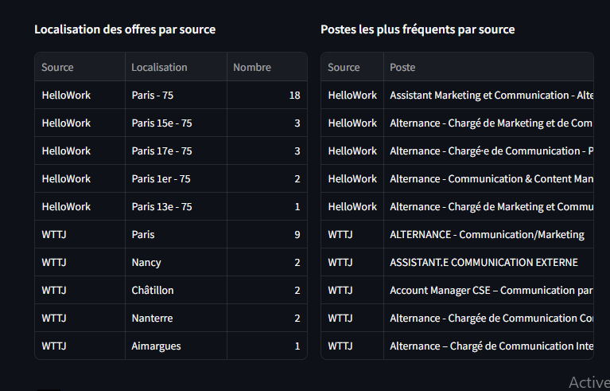
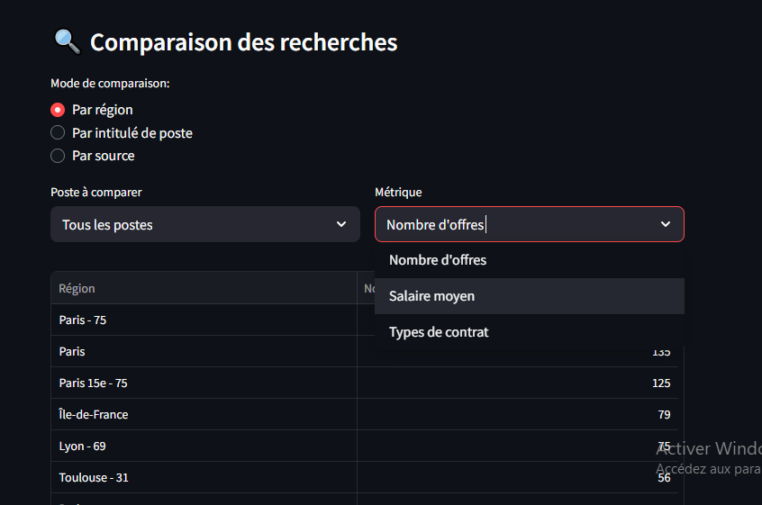

# JOB SNIFFER

## Présentation

JOB SNIFFER est un outil de scraping d'offres d'emploi conçu pour extraire les annonces d'emploi de diverses sources, notamment HelloWork et Welcome to the Jungle. L'outil fournit une interface utilisateur conviviale pour rechercher des emplois, filtrer les résultats et analyser les tendances du marché de l'emploi.

## Fonctionnalités

*   Scraping d'offres d'emploi à partir de plusieurs sources (HelloWork, Welcome to the Jungle)
*   Recherche d'emplois par titre, localisation et autres critères
*   Filtrage des annonces d'emploi en fonction de divers attributs (type de contrat, entreprise, etc.)
*   Analyse des tendances et des statistiques du marché de l'emploi (nombre d'annonces, salaire moyen, etc.)
*   Comparaison des annonces d'emploi entre différentes sources et régions
*   -Export results to CSV and JSON formats

## Utilisation

1.  Entrez vos critères de recherche d'emploi (titre, localisation, etc.) dans la barre de recherche.
2.  Sélectionnez les sources que vous souhaitez scraper (HelloWork, Welcome to the Jungle, etc.).
3.  Cliquez sur le bouton "Lancer le scraping" pour lancer le processus de scraping.
4.  Parcourez les annonces d'emploi et filtrez-les en fonction de vos préférences.
5.  Analysez les tendances et les statistiques du marché de l'emploi fournies dans le tableau de bord.

## Tableau de bord

Le tableau de bord fournit diverses informations sur le marché de l'emploi, notamment :

*   Top 10 des entreprises avec le plus d'annonces d'emploi
*   Comparaison des annonces d'emploi entre différentes sources
*   Répartition des annonces d'emploi par type de contrat et localisation
*   Salaire moyen et salaire médian pour différents titres d'emploi
*   Tendances et statistiques du marché de l'emploi

  

## Exigences techniques

*   Python 3.x
*   Streamlit
*   Scrapy
*   Autres dépendances listées dans `requirements.txt`

## Installation

1.  Clonez le dépôt : `git clone https://github.com/votre-nom-utilisateur/job-sniffer.git`

cd jobsniffer 

2.  Installez les dépendances : `pip install -r requirements.txt`
3.  Exécutez l'application : `streamlit run main.py`

